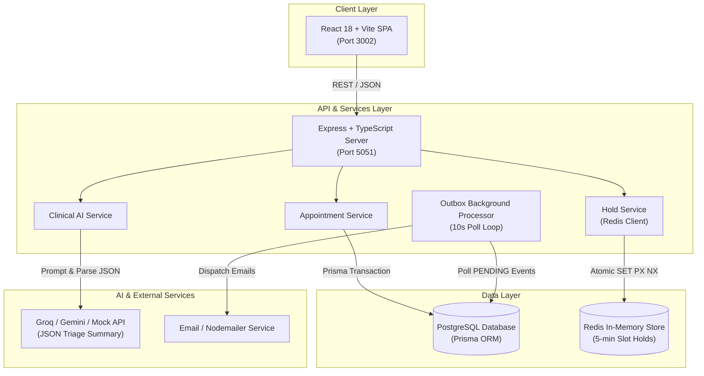
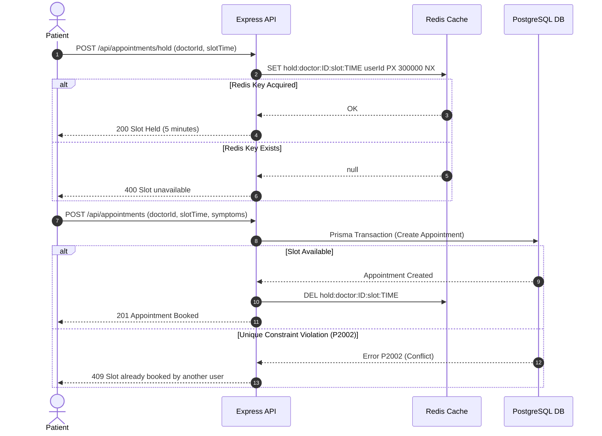
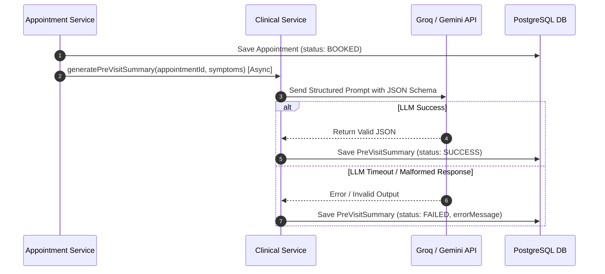
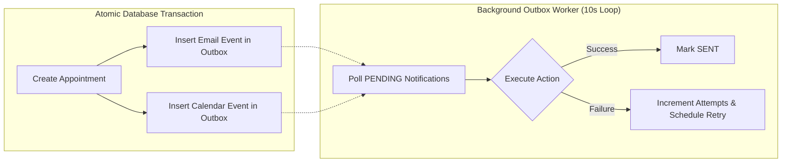

# CareManager — System Architecture Specification

This document details the architectural layout, component interactions, data flow, concurrency patterns, and AI pipeline of the **CareManager** platform.

---

## 1. High-Level System Architecture

CareManager uses a decoupled multi-tier architecture separating the client-side SPA, backend API service, distributed cache/lock store, relational database, background task processor, and external AI provider services.

---

## 2. Component Responsibilities

### A. Frontend Layer (`frontend/`)
- **React 18 + Vite Single Page Application**: Serves user interface components across 11 primary views.
- **MainLayout & App Shell**: Implements a unified clinical sidebar for authenticated patients, doctors, and admins.
- **State Management (`useApp.js`)**: Manages session auth tokens, user roles, medication lists, symptom history, and modal states.
- **API Integration (`services/api.js`)**: Encapsulates Axios HTTP calls configured via `VITE_API_URL`.

### B. Backend API Server (`backend-node/src/server.ts`)
- **Express + TypeScript Router**: Entry point handling CORS, JSON body parsing, and routing for `/api/auth`, `/api/doctors`, `/api/appointments`, `/api/symptoms`, and `/api/health`.
- **Authentication Middleware (`middleware/auth.ts`)**: Verifies JWT bearer tokens, attaches decoded user object (`req.user`) to request context, and enforces role-based access (`PATIENT`, `DOCTOR`, `ADMIN`).

### C. Database & ORM Layer (`backend-node/prisma/`)
- **PostgreSQL Database**: Relational datastore containing 10 core tables: `User`, `DoctorProfile`, `DoctorLeave`, `SlotHold`, `Appointment`, `PreVisitSummary`, `Consultation`, `Prescription`, `PrescriptionItem`, `PostVisitSummary`, `MedicationReminder`, and `OutboxNotification`.
- **Prisma ORM (`config/db.ts`)**: Generates type-safe database access client, executes schema migrations, and handles interactive transactions (`prisma.$transaction`).

### D. Redis Slot Hold Layer (`services/holdService.ts`)
- **Redis Client (`config/redis.ts`)**: In-memory Redis instance executing distributed lock operations.
- **Atomic Operations**:
  - `holdSlot()`: Executes `SET hold:doctor:{id}:slot:{iso} {userId} PX 300000 NX` (5-minute TTL lock).
  - `releaseSlot()`: Executes atomic Lua script checking owner match before deletion.
  - **Graceful Fallback**: If Redis service is unreachable, `holdService` logs a warning and returns `true`, permitting database-level transaction validation to act as the fallback safety barrier.

### E. Clinical AI Engine (`services/aiService.ts` & `clinicalService.ts`)
- **LLM Interface**: Integrates with Groq (`llama-3.3-70b-versatile`), Google Gemini (`gemini-1.5-flash`), or Mock provider fallback.
- **Pre-Visit Triage**: Prompt engineering forces strict JSON schema validation containing `urgency`, `chiefComplaint`, and `suggestedQuestions`.
- **Post-Visit Summaries**: Converts physician SOAP notes and prescription items into patient-accessible medical guides and structured dosage timing models.
- **Resilience Strategy**: AI generation executes asynchronously post-booking. If the external LLM times out or returns malformed JSON, `PreVisitSummary` is saved with `status: FAILED` and `errorMessage`, leaving the patient's appointment valid and booked.

### F. Asynchronous Outbox Worker (`services/outboxProcessor.ts`)
- **Transactional Outbox Pattern**: Database updates write event payloads directly to `OutboxNotification` table inside the primary Prisma transaction.
- **Polling Processor**: Runs every 10 seconds checking for `PENDING` or retry-eligible `FAILED` notifications.
- **Delivery**: Dispatches transactional emails via Nodemailer or Resend service and updates event state to `SENT` or `FAILED`.

