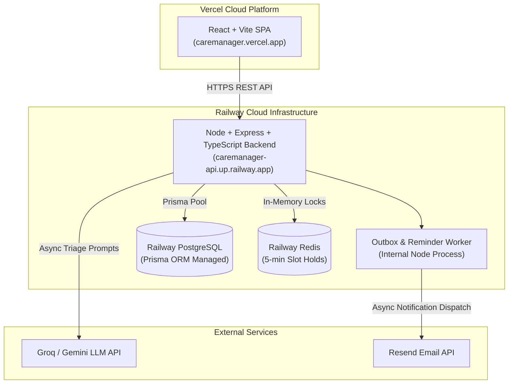

# CareManager — Deployment Readiness Audit & Guide

**Project Name**: CareManager (Healthcare Appointment & Follow-up Manager)  
**Audit Date**: August 20, 2026  
**Target Architecture**: Vercel (Frontend) + Railway (Backend, PostgreSQL, Redis)  
**Audit Result**: **READY TO DEPLOY**

---

## 1. Target Deployment Architecture



---

## 2. Environment Variables Matrix

### A. Vercel Environment Variables (Frontend)

| Variable Name | Required Value / Format | Purpose |
| :--- | :--- | :--- |
| `VITE_API_URL` | `https://your-backend.up.railway.app` | Target backend REST API URL for production |

### B. Railway Environment Variables (Backend Service)

| Variable Name | Required Value / Format | Purpose |
| :--- | :--- | :--- |
| `PORT` | Auto-assigned by Railway | HTTP listener port |
| `DATABASE_URL` | Auto-provided by Railway PostgreSQL | PostgreSQL connection string with SSL parameters |
| `REDIS_URL` | Auto-provided by Railway Redis | Redis connection string (`redis://` or `rediss://`) |
| `JWT_SECRET` | Strong random 64-char string | Secret key for signing and verifying user JWT tokens |
| `LLM_PROVIDER` | `GROQ` (or `GEMINI` / `MOCK`) | Active AI clinical triage provider |
| `GROQ_API_KEY` | `gsk_...` | Groq API authentication key |
| `GEMINI_API_KEY` | `AIzaSy...` (Optional if using Groq) | Google Gemini API key |
| `STRICT_AI_MODE` | `false` | Fall back to mock AI gracefully if API limits are hit |
| `FRONTEND_URL` | `https://your-app.vercel.app` | Production frontend domain for CORS & email links |
| `RESEND_API_KEY` | `re_...` (Optional) | Resend API key for transactional emails |
| `SMTP_FROM` | `no-reply@caremanager.health` | Default email sender address |

---

## 3. Deployment Component Requirements

### A. Frontend (Vercel)
- **Root Directory**: `frontend`
- **Build Command**: `npm run build` (`vite build`)
- **Output Directory**: `dist`
- **Install Command**: `npm install`
- **SPA Routing Rewrites**: Handled by `frontend/vercel.json`:
  ```json
  {
    "rewrites": [
      { "source": "/(.*)", "destination": "/index.html" }
    ]
  }
  ```

### B. Backend API (Railway)
- **Root Directory**: `backend-node`
- **Build Command**: `npx prisma generate && npm run build`
- **Start Command**: `npx prisma migrate deploy && npm start`
- **Health Check Endpoint**: `/api/health` (Returns HTTP 200 `{ status: "OK", database: "Connected" }`)
- **CORS Policy**: Configured in `server.ts` (`app.use(cors())`), allowing production requests from Vercel.

### C. Primary Database (Railway PostgreSQL)
- **Migration Execution**: Deploy migrations using `npx prisma migrate deploy` in the Railway release step.
- **Connection Strategy**: Prisma Client manages connection pooling automatically via `DATABASE_URL`.
- **Development Seed Safety**: Production seed script (`prisma/seed.ts`) uses `upsert` operations and demo flags. Running `npm run seed` in production is optional and safe.

### D. Redis In-Memory Lock Engine (Railway Redis)
- **Reconnection Handling**: `ioredis` in `config/redis.ts` handles disconnections gracefully without crashing backend.
- **Failover Protection**: If Redis is offline, `holdService` passes validation to PostgreSQL atomic unique constraints (`P2002`).

### E. Background Processing Engine
- **Outbox Worker**: `outboxProcessor.ts` automatically starts on `app.listen()` and polls `OutboxNotification` table every 10 seconds.
- **Medication Reminders**: `reminderService.ts` automatically initializes inside the Node server process.

---

## 4. Known Blockers Check

| Check Area | Audit Result | Status |
| :--- | :--- | :---: |
| **Hardcoded Localhost URLs** | All endpoints utilize `import.meta.env.VITE_API_URL` or `process.env.FRONTEND_URL` with local fallbacks | **CLEAN** |
| **Exposed Secrets** | Real secrets isolated in `.env` files (untracked in git); `.env.example` templates provided | **CLEAN** |
| **Build Compilations** | `npm run build` (Vite) & `tsc` pass with 0 errors | **CLEAN** |
| **Test Suites** | 100% pass rate across Concurrency (11/11) & Workflow (26/26) suites | **CLEAN** |
| **Deployment Blockers** | **0 active blockers** identified | **CLEAN** |

---

## 5. Exact Step-by-Step Deployment Sequence

1. **Step 1: Push Codebase to GitHub**
   - Push repository to your private/public GitHub account:
     ```bash
     git remote add origin git@github.com:username/CareManager.git
     git push -u origin main
     ```

2. **Step 2: Deploy Database & Cache on Railway**
   - Log into [Railway.app](https://railway.app/) and create a **New Project**.
   - Add a **PostgreSQL** database service.
   - Add a **Redis** cache service.

3. **Step 3: Deploy Backend Node API on Railway**
   - Click **Add Service** → **GitHub Repo** → Select `CareManager`.
   - Set **Root Directory** to `backend-node`.
   - Set **Build Command**: `npx prisma generate && npm run build`
   - Set **Start Command**: `npx prisma migrate deploy && npm start`
   - Add Environment Variables:
     - `DATABASE_URL` (Reference PostgreSQL connection string)
     - `REDIS_URL` (Reference Redis connection string)
     - `JWT_SECRET` (e.g. `caremanager_prod_jwt_secret_998877!`)
     - `LLM_PROVIDER` (`GROQ` or `MOCK`)
     - `GROQ_API_KEY` (`gsk_...`)
     - `FRONTEND_URL` (`https://caremanager.vercel.app`)
   - Copy generated Railway backend URL (e.g. `https://caremanager-api.up.railway.app`).

4. **Step 4: Deploy Frontend on Vercel**
   - Log into [Vercel.com](https://vercel.com/) and click **Add New** → **Project**.
   - Import `CareManager` repository from GitHub.
   - Set **Root Directory** to `frontend`.
   - Add Environment Variable:
     - `VITE_API_URL` = `https://caremanager-api.up.railway.app`
   - Click **Deploy**.

5. **Step 5: Production Verification**
   - Access `https://caremanager-api.up.railway.app/api/health` to confirm backend & database connection status.
   - Open `https://caremanager.vercel.app` to verify patient registration, doctor booking, pre-visit summary generation, and doctor consultation features.

---

```
================================================================================
                           DEPLOYMENT READINESS VERDICT
================================================================================

                             READY TO DEPLOY

================================================================================
```
